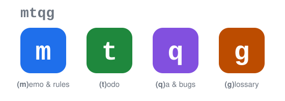

# mtqg

*[日本語](README_ja.md) | **English***

<p align="center">
  
</p>

<p align="center"><strong>Project records for humans and AI agents, kept right in your git repo</strong></p>

<p align="center">
  <a href="https://github.com/amisonnet8/mtqg/actions/workflows/ci.yml"></a>
  <a href="https://github.com/amisonnet8/mtqg/releases"></a>
  <a href="LICENSE"></a>
  <a href="go.mod"></a>
  <a href="https://pkg.go.dev/github.com/amisonnet8/mtqg"></a>
</p>

<p align="center">
  <a href="#features">Features</a> ·
  <a href="#demo">Demo</a> ·
  <a href="#install">Install</a> ·
  <a href="#quick-start">Quick start</a> ·
  <a href="#learn-more">Learn more</a>
</p>

Working on something produces things that never make it into the code or a commit: things noticed along the way, things to do, questions and their answers, bugs and the back-and-forth about them, terms the team agreed on. Until now these scattered across chat history and note apps, and got lost. mtqg appends them to one file, `.mtqg/journal.jsonl`, in the same git repository as the code, committed and shared the same way.

## Features

- 📝 **Append-only** — existing lines are never rewritten. Journal lines are plain JSON Lines, so a union merge keeps both branches' records
- 🗂️ **Six kinds** — `memo`, `todo`, `qa`, `bug`, `glossary`, `rule`. No project-management features (priority, due dates, assignees, kanban) — just the process, kept lightweight
- 🤖 **Built for AI agents** — `mtqg context` hands a session everything it needs at the start; `mtqg init --agent claude-code` wires up Claude Code's hooks and MCP server in one step
- 🔌 **`--json` on every command** — companion tools and editor extensions connect through `--json` alone; the shape only ever grows by adding fields
- 📦 **Single binary, no cgo** — the same binary works on Linux, macOS and Windows. Dependencies are limited to the Go standard library and `golang.org/x/`
- 🔍 **Shows conflicts as facts** — concurrent answers to the same question, duplicate glossary definitions. mtqg never decides which is right; `mtqg review` lays both out for a person to judge

## Demo

<p align="center">
  
</p>

## Install

```bash
go install github.com/amisonnet8/mtqg/cmd/mtqg@latest
```

Prebuilt binaries for each OS are on [Releases](https://github.com/amisonnet8/mtqg/releases) (linux, darwin, windows; amd64, arm64).

Shell completion (bash, zsh, fish, PowerShell): see [Shell completion](docs/reference/cli.md#shell-completion).

## Quick start

In a project's repository, run `mtqg init` once.

```
$ mtqg init
Created .mtqg/ in /home/me/sample-parser
Commit it to share the records.
```

Things noticed along the way go in a `memo`; things to do before you start them go in a `todo`. No verb, just `add`, and the output is only the ID of the record that was made:

```
$ mtqg m add Tokens carry their line and column
b6868dd1af
$ mtqg t add Support C syntax
f7443f148b
```

Something you are unsure about goes in a `qa`. Following the body's ID with more text makes that text an answer; `done` is a separate action, and the question shows as "awaiting confirmation" until it is closed (from here on, this looks in on the same project a while later):

```
$ mtqg show 2217beaddb
question  2217beaddb  open
by claude-code (ai), 2026-09-21 11:05

  Should error positions show both line and column?

Events
  2026-09-21 11:05  create  claude-code (ai)
$ mtqg q add 2217beaddb Yes, callers usually want both
dfb354fcde
$ mtqg q done 2217beaddb
Done: 2217beaddb  Should error positions show both line and column?
```

<details>
<summary>See <code>mtqg context</code> (what an AI agent reads at the start of a session)</summary>

```
$ mtqg context
# mtqg context — sample-parser (main)

This is the process record of this project. Read the following before you start working.
- Follow the rules listed under Rules
- Respect answered questions
- Do not decide open questions on your own; confirm them
- Use terms as defined in the glossary
- Record questions, decisions, findings, bugs, and todos with mtqg as they come up

## Attention
- Glossary term "block comment" has conflicting definitions (see mtqg glossary list)
- todo 6b0d549b6f "Skip line comments //" has concurrent changes (see mtqg review)
- 3 mtqg records are not committed

## Open todos (5)
- 6cad4a268d Skip block comments /* */ (claude-code, 10:18)
- 6513270e26 Ignore // inside string literals (yamada, 10:52)
- 1e27a1c08a Show error positions as line and column (claude-code, 11:06)
- 1818e81189 List the supported syntax in the README (yamada, 11:30)
- 2e44158bae Add test cases for comment handling (claude-code, 11:32)

## Open questions (2)
- 1012f037b6 Should nested block comments be supported? (awaiting confirmation, claude-code, 09:10)
    └ Not in the first version. Revisit if there is demand (yamada, human)
- 2217beaddb Should error positions show both line and column? (unanswered, claude-code, 11:05)

## Open bugs (1)
- 7f3a2b1c09 Parser crashes on empty input (awaiting confirmation, yamada, 10:41)
    └ Reproduced on macOS too (claude-code, ai)

## Recent records (newest first)
- 11:32  claude-code  todo      2e44158bae  Add test cases for comment handling
- 11:30  yamada       todo      1818e81189  List the supported syntax in the README
- 11:24  claude-code  glossary  f28c105d1f  lexing: Reading source and turning it into a sequence of tokens
- 11:06  claude-code  todo      1e27a1c08a  Show error positions as line and column
- 11:05  claude-code  question  2217beaddb  Should error positions show both line and column?
- 10:52  yamada       todo      6513270e26  Ignore // inside string literals
- 10:46  claude-code  reply     9a8b7c6d5e  Also fails with an empty file (to 1012f037b6)
- 10:45  claude-code  reply     3d8e4a0b12  Reproduced on macOS too (to 7f3a2b1c09)
- 10:41  yamada       bug       7f3a2b1c09  Parser crashes on empty input
- 10:32  yamada       memo      81e74ef5e8  Policy: use English for all error messages
- (12 more; see mtqg log)

## Glossary (4)
- 5b7e2c9a41 token: The smallest unit produced by lexing
- f29d0da995 block comment: A comment enclosed in /* and */
- 0cb1e29c65 block comment: A comment that can span multiple lines
- f28c105d1f lexing: Reading source and turning it into a sequence of tokens

---
Read full entries with mtqg show <id>.
```

</details>

<details>
<summary>See a <code>--json</code> example</summary>

```
$ mtqg show --json 81e74ef5e8
{
  "command": "show",
  "record": {
    "id": "81e74ef5e8e24d949ed904759531985d",
    "kind": "memo",
    "text": "Policy: use English for all error messages",
    "author": {
      "kind": "human",
      "name": "yamada"
    },
    "created": "2026-09-21T10:32:00Z",
    "updated": "2026-09-21T10:32:00Z"
  },
  "events": [
    {
      "id": "81e74ef5e8e24d949ed904759531985d",
      "op": "create",
      "type": "memo",
      "text": "Policy: use English for all error messages",
      "v": 0,
      "ts": "2026-09-21T10:32:00Z",
      "author": {
        "kind": "human",
        "name": "yamada"
      }
    }
  ]
}
```

</details>

## Learn more

- [mtqg examples](docs/examples/examples.md) — a single walkthrough from getting started to worked examples
- [Command reference](docs/reference/cli.md) — the full command specification
- [Journal format](docs/reference/schema.md) — the data format specification (embedded as `.mtqg/SCHEMA.md` in every project)
- [Design docs](docs/design/README.md) — design decisions and their reasoning (Japanese only)
- [Interactive guide](https://notebook.google.com/notebook/de72731c-6070-491c-95ec-fe2f2006cfb5) — explore mtqg by asking questions (made with Gemini Notebook)

---

MIT License. See [LICENSE](LICENSE).
